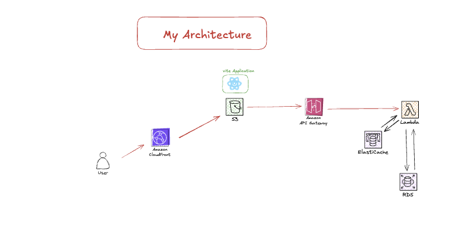
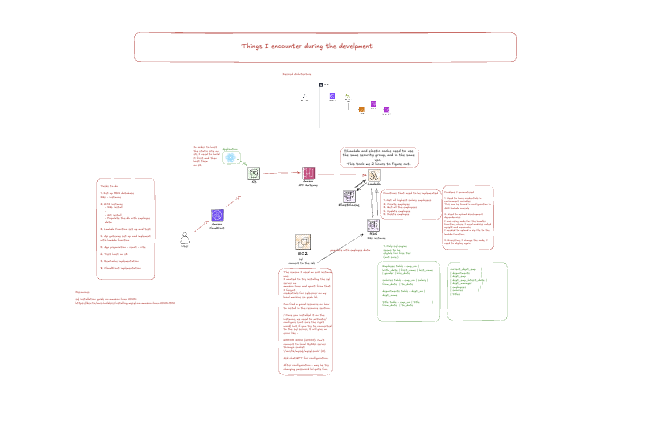

# Employee Dashboard Implementation Using AWS Services

## Overview

This project demonstrates an Employee Dashboard built with a fully serverless and scalable architecture leveraging various AWS services. The design ensures high availability, cost efficiency, and minimal maintenance.

## Table of Contents
- [Key AWS Services Used](#key-aws-services-used)
- [Application Architecture](#application-architecture)
  - [Frontend](#frontend)
  - [Backend & Data Layer](#backend--data-layer)
- [Interaction Flow](#interaction-flow)
- [Documentation & Implementation Details](#documentation--implementation-details)
- [Contributing & Support](#contributing--support)

## Key AWS Services Used
- **Frontend:** React.js with Vite, hosted on Amazon S3
- **API Management:** Amazon API Gateway
- **Compute Layer:** AWS Lambda
- **Database:** Amazon RDS (MySQL)
- **Caching:** Amazon ElastiCache (Redis/Memcached) for faster query responses
- **Content Delivery:** Amazon CloudFront for CDN caching and global distribution
- 
## Application Architecture

### Frontend
- **Framework:**
  - Developed using React.js and Vite for optimized builds and fast development.
- **Hosting:**
  - Static website hosted in an Amazon S3 bucket with CloudFront for global content distribution and caching.
- **API Interaction:**
  - The frontend makes API requests using Fetch/Axios to communicate with the backend.
- **Authentication:**
  - (If applicable) AWS Cognito for user authentication and session management.
- **Access URL:**
  - [Live Demo](https://d2llat4at3sykp.cloudfront.net/)

### Backend & Data Layer

- **API Management:**
  - Amazon API Gateway serves as a secure, scalable interface between the frontend and backend.

- **Serverless Functions:**
  - AWS Lambda functions handle business logic and CRUD operations.
  - Written in Node.js.

- **Database:**
  - Amazon RDS running MySQL for structured employee data.

- **Caching:**
  - Amazon ElastiCache (Memcached) to reduce database load and improve response times.
  - CloudFront CDN caches static assets to optimize performance and reduce latency.

## Interaction Flow

1. **User Request:**
   - The frontend (hosted on S3) sends an API request through API Gateway.
2. **API Processing:**
   - API Gateway routes incoming requests to the appropriate AWS Lambda function.
3. **Data Operations:**
   - Lambda interacts with Amazon RDS for database transactions.
   - Cached responses may be served from ElastiCache to improve performance.
4. **Content Delivery:**
   - CloudFront caches static assets and serves them efficiently.
5. **Response:**
   - Processed data is returned to the frontend via API Gateway, updating the dashboard in real-time.

## Documentation & Implementation Details

- **Step-by-Step Development Process:**
  - A detailed guide covering architecture decisions, troubleshooting, and optimizations is available on [Excalidraw](https://excalidraw.com/#json=G2Ui8JUMJXeXy6X10nOw8,OkT6xYOuzXdpsDIGDwyXBw).
  
  

## Contributing & Support

If you find this project useful, please consider giving it a star! Contributions, feedback, and suggestions are always welcome. Feel free to open an issue or submit a pull request.
