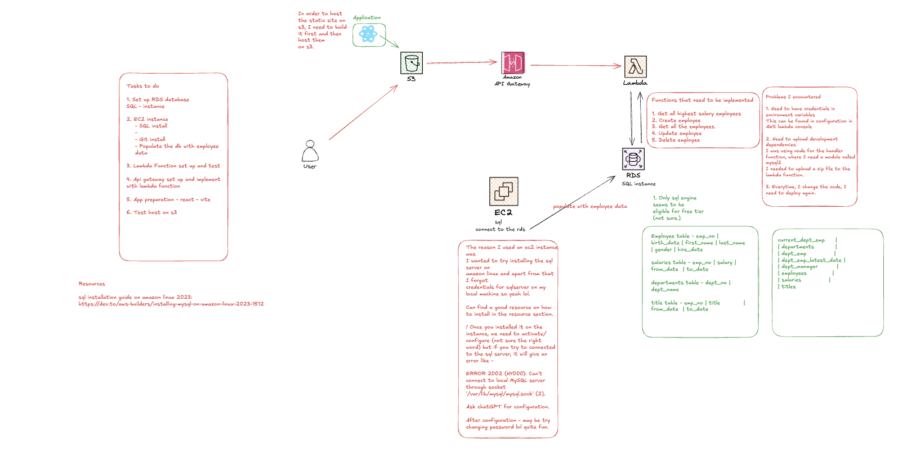

Below is an updated and refined version of your README:

---

# Employee Dashboard Implementation Using AWS Services

## Work in Progress

This project demonstrates an Employee Dashboard built with a fully serverless and scalable architecture using various AWS services.

## Achievements So Far

- **Frontend Hosting:**  
  - Website hosted on an Amazon S3 bucket.
- **API Integration:**  
  - Amazon API Gateway implemented.
- **Serverless Backend:**  
  - AWS Lambda functions for data manipulation.
- **Database:**  
  - Amazon RDS (MySQL) serves as the primary data store.
 

## Upcoming Enhancements

- **CloudFront:**  
  - Integration for improved content delivery and security.
- **Caching:**  
  - Implementation of caching using Amazon ElastiCache.

## Application Architecture

### Frontend

- **Framework:**  
  - Developed with React.js and Vite for rapid development and optimized builds.
- **Hosting:**  
  - Static site hosted on an Amazon S3 bucket.
- **Access URL:**  
  - [http://employee-dashboard-app-s3bucket.s3-website-us-east-1.amazonaws.com/](http://employee-dashboard-app-s3bucket.s3-website-us-east-1.amazonaws.com/)

### Backend & Data Layer

- **Database:**  
  - Amazon RDS running MySQL.
- **Serverless Functions:**  
  - AWS Lambda functions perform all data manipulation operations.
- **API Management:**  
  - Amazon API Gateway exposes a RESTful API for secure communication between the frontend and backend services.

## Interaction Flow

1. **User Request:**  
   The frontend (hosted on S3) sends requests via the API Gateway.
2. **API Processing:**  
   API Gateway routes incoming requests to the appropriate AWS Lambda function.
3. **Data Operations:**  
   Lambda functions perform CRUD operations by interacting with the MySQL database on RDS.
4. **Response:**  
   Processed data is returned through API Gateway back to the frontend, updating the dashboard in real time.

## Documentation & Implementation Details

- **Architecture Diagram:**  
  An illustrative diagram showing the components and data flow is part of the project.

  
  
- **Step-by-Step Documentation:**  
  A detailed write-up of the development process—including encountered challenges, lessons learned, and troubleshooting—is available on [Excalidraw](https://excalidraw.com/#json=G2Ui8JUMJXeXy6X10nOw8,OkT6xYOuzXdpsDIGDwyXBw).

## Contributing & Support

If you find this project useful, please consider giving it a star! Contributions, feedback, and suggestions are always welcome.
